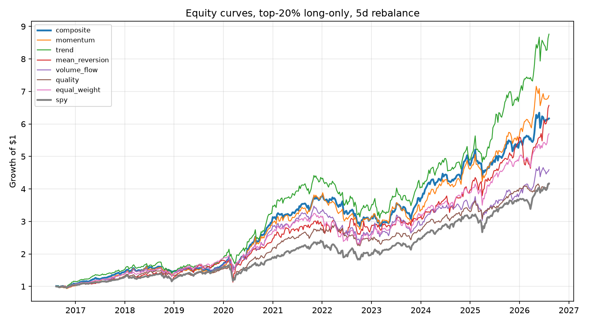
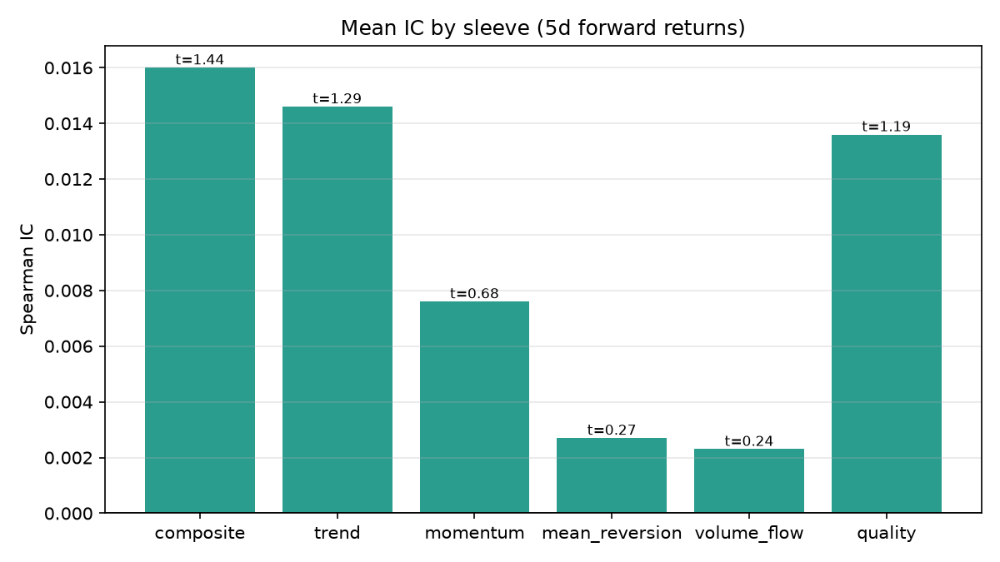
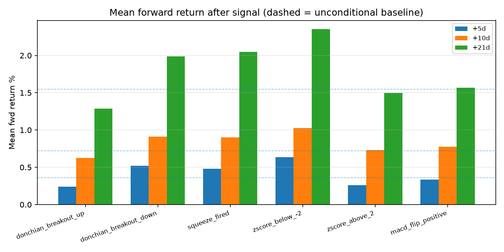
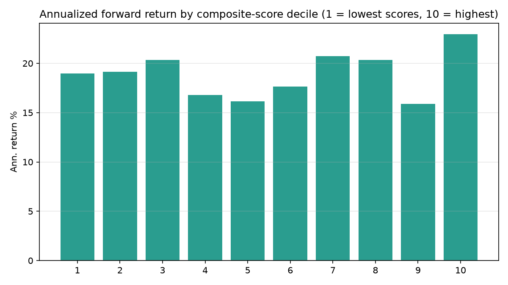

# Stock Indicator

A multi-factor stock scoring and screening system with a walk-forward backtesting
harness. A Flask dashboard scans a watchlist of ~80 stocks and ETFs on a schedule,
scores every name at five horizons (1d to 1y) with a regime-aware factor model, ranks
the universe cross-sectionally, tracks how those ranks move over time, and maintains
a recommended portfolio of at most 20 names. Every part of the scoring model is
backtested below, with the good and the bad results shown as they came out.

The intended rhythm: check the dashboard in the morning to see what is worth buying
(1d/1w columns for timing, the recommended portfolio for what), then again before the
close to see whether anything needs repositioning. The recommendation is deliberately
slow-moving - it is not meant to be traded every scan.

Heavily influenced by [huseinzol05/Stock-Prediction-Models](https://github.com/huseinzol05/Stock-Prediction-Models),
in particular the idea that a repo about trading models should lead with measured
results rather than feature lists.

## Table of contents

- [How it works](#how-it-works)
- [Indicator library](#indicator-library)
- [Factor model](#factor-model)
- [Regime model](#regime-model)
- [Recommended portfolio](#recommended-portfolio)
- [Agents](#agents)
- [Results](#results)
  - [Results: agents](#results-agents)
  - [Results: honesty checks](#results-honesty-checks)
  - [Results: information coefficients](#results-information-coefficients)
  - [Results: signal event studies](#results-signal-event-studies)
  - [Results: score deciles](#results-score-deciles)
- [Analysis](#analysis)
- [Backtest caveats](#backtest-caveats)
- [Installation](#installation)
- [Usage](#usage)
- [Project structure](#project-structure)
- [Disclaimer](#disclaimer)

## How it works

1. Daily OHLCV history is cached locally in SQLite (`data_store.py`) and refreshed
   incrementally, so a full scan does not re-download years of data.
2. `quant_engine.SymbolAnalyzer` computes every indicator series once per symbol and
   evaluates five factor sleeves at each horizon. All indicators are causal
   (rolling / ewm / cumsum), so the same code path scores live data and historical
   bars without lookahead. There is a test for this (`test_no_lookahead`).
3. Symbols are ranked cross-sectionally by composite score into ranks 1-10.
4. A background thread re-scans the watchlist on the configured interval, stores every
   run, and surfaces rank movers between runs.
5. Market context (SPY vs 200dma, VIX percentile) and cached fundamentals (valuation,
   ROE, upcoming earnings) are layered on top for display and signals. They stay out
   of the composite score because they cannot be backtested point-in-time with the
   data available here.

## Indicator library

`quant_indicators.py`, numpy/pandas only.

| Group | Indicators |
| --- | --- |
| Volatility | ATR (Wilder), close-to-close realized vol, Parkinson, Garman-Klass, volatility percentile |
| Trend / momentum | multi-horizon total-return momentum, 12-1 momentum, risk-adjusted momentum (t-stat), KAMA, Kaufman efficiency ratio, regression trend (slope x R^2), 52-week-high proximity |
| Mean reversion | price z-score, Hurst exponent, OU half-life, Lo-MacKinlay variance ratio |
| Volume / flow | Money Flow Index, Chaikin Money Flow, OBV z-score, rolling VWAP deviation, relative volume |
| Channels | Bollinger, Keltner, TTM squeeze (with fire detection), Donchian breakout |
| Risk | Sharpe, Sortino, Calmar, max drawdown, historical VaR/CVaR, beta/alpha vs SPY, skew/kurtosis |

Plus the classic set (RSI, MACD, stochastic, ADX, PSAR, OBV) in `indicators.py`.

## Factor model

Indicators are combined into five sleeves, each scored in [-1, +1]:

1. **trend** - MA structure, price vs KAMA, regression trend graded by fit quality, Donchian channel position
2. **momentum** - risk-adjusted momentum t-stat, total-return momentum, MACD normalized by ATR, 52-week-high proximity, 12-1 momentum at long horizons
3. **mean_reversion** - z-score, RSI, Bollinger %B, stochastic, scored contrarian (oversold is positive)
4. **volume_flow** - MFI, CMF, OBV trend, VWAP deviation
5. **quality** - rolling Sharpe, drawdown depth, volatility regime

Each horizon (1d / 1w / 1m / 6m / 1y) uses lookbacks matched to its implied holding
period. The composite is a weighted sum of sleeves scaled to [-100, +100], with a
20% haircut when volatility is above its 85th percentile.

On top of the regime weights, each horizon applies a fixed tilt: the tactical
columns (1d, 1w) lean toward mean reversion and the long columns (6m, 1y) toward
momentum, matching the term structure measured in the IC results below. The tilts
were calibrated on those same ICs, so they are in-sample - treat them as informed
defaults rather than validated edge.

## Regime model

A per-symbol classifier decides how much to trust each sleeve. Evidence is pooled
from the Hurst exponent, variance ratio, ADX and Kaufman efficiency ratio:

| Regime | trend | momentum | mean_rev | flow | quality |
| --- | --- | --- | --- | --- | --- |
| trending | 0.32 | 0.28 | 0.08 | 0.17 | 0.15 |
| mixed | 0.22 | 0.20 | 0.20 | 0.18 | 0.20 |
| mean-reverting | 0.10 | 0.12 | 0.38 | 0.20 | 0.20 |

The idea: momentum signals get weight when the tape is persistent, stretch/reversion
signals when it chops. Whether this earns its keep is examined in the results.

Those fifteen numbers were picked by judgement. `regime_calibrate.py` now tries to
replace them with estimates: it labels regimes (either with the classifier above or
with a statistical jump model, `regime.py`), ridge-regresses forward returns on sleeve
scores within each state, shrinks the result toward the hand table, and then tests it
on a held-out window. It installs nothing unless the calibrated table wins there.

So far it has not. On the first run the calibrated table looked far better on the
discovery window (IC 0.047 vs 0.007) and came out **worse** on validation (-0.088 vs
-0.056). That is textbook in-sample fitting, and the hand-set prior stayed in force -
now for a measured reason rather than by default.

## Recommended portfolio

The dashboard maintains a suggested long-only portfolio of at most 20 names
(`recommender.py`), built from the latest scan:

- **Selection**: highest 1m composite scores - the horizon the walk-forward backtest
  validated. The 1d/1w scores are shown for entry timing only, so the list does not
  churn with every intraday scan. Names with a negative score never fill a slot.
- **Correlation dedup**: a candidate correlated above 0.92 with an already-selected
  name is skipped (stops QQQ and VOO both taking a slot).
- **Hysteresis**: an incumbent keeps its place while it still ranks in the top 1.5x
  of the target size, so small score wiggles do not force trades.
- **Weighting**: inverse volatility with a mild score tilt, capped at 15% per name,
  so each position contributes roughly similar risk.
- **Dollar targets and a rebalance plan**: weights are converted into concrete
  dollar amounts and (fractional) share counts, sized off your portfolio's market
  value by default or any base amount you type. The rebalance plan lists exactly
  what to buy and sell to move your current holdings to the target weights; trades
  under 1% of the base are skipped, and a full exit uses your exact held share
  count. A sell there is a prompt to review, not an order.

The exact scheme is backtestable (`python backtest.py --top 0.24 --weighting inv_vol`).
Over the same 3 years as the headline run, holding the top ~20 of 83 names:

| weighting | CAGR % | Sharpe | max DD % | hit rate % |
| --- | --- | --- | --- | --- |
| equal | 27.2 | 1.68 | -10.1 | 62.3 |
| inverse-vol (used here) | 19.4 | 1.55 | **-8.6** | **65.6** |

The tradeoff is explicit: inverse-vol weighting gave up ~8 points of CAGR in this
bull-market sample (low-vol names drag when everything rises) in exchange for the
shallowest drawdown of any configuration tested and a higher hit rate. That matches
the intended use - a portfolio checked twice a day, not traded twice a day. If you
prefer the return profile, the equal-weight variant is one flag away.

## Agents

Eight strategies run through the same walk-forward harness (`backtest.py`):

1. **composite** - regime-weighted blend of all five sleeves
2. **trend** - trend sleeve alone
3. **momentum** - momentum sleeve alone
4. **mean_reversion** - reversion sleeve alone
5. **volume_flow** - flow sleeve alone
6. **quality** - quality sleeve alone
7. **equal_weight** - hold the whole universe (benchmark)
8. **spy** - buy and hold SPY (benchmark)

Each strategy ranks the universe at every rebalance and holds the top 20%
equal-weight, long-only.

## Results

> **Read this first.** The results in this section are the original three-year run.
> A later pass added transaction costs, a deflated Sharpe that counts every
> configuration tried, a probability-of-backtest-overfitting statistic, a bull/bear
> split and a permutation audit - the checks the methodology literature says decide
> whether a backtest means anything (`docs/research-llm-agents.md`). Those checks
> changed it. The current numbers, measured over fifteen years of history rather
> than three, are in [Results: honesty checks](#results-honesty-checks). The
> three-year run is kept here because deleting a superseded result and keeping only
> the convenient one would be its own kind of dishonesty.

Setup for the headline run: 83 symbols (the default watchlist: US large caps plus
sector/asset-class ETFs), 3 years (2023-08 to 2026-08), scores at the 1m horizon,
rebalanced every 5 sessions, top 20% held long-only, no transaction costs.
Reproduce with `python backtest.py --years 3`.

The one-line version: $10,000 in the model became **$20,850** over the window,
versus $18,680 for holding the whole watchlist equal-weight and $17,750 for SPY -
with a worst drawdown of -9.2% against SPY's -14.0%. The equal-weight comparison is
the honest one: it shows the model's selection added ~22 points beyond what the
watchlist itself delivered. (Before costs, in one bull-market sample - see the
caveats.) **Over ten years the model beats the watchlist by 47 points instead - see
the honesty checks below, where a longer sample changes several of these numbers.**

### Results: agents

| agent | CAGR % | ann vol % | Sharpe | max DD % | hit rate % | turnover/rebal |
| --- | --- | --- | --- | --- | --- | --- |
| composite | 27.8 | 15.4 | 1.67 | **-9.2** | 59.6 | 0.37 |
| trend | **32.4** | 17.3 | **1.72** | -11.7 | 57.6 | 0.32 |
| momentum | 28.9 | 15.7 | 1.70 | -11.2 | 58.3 | 0.41 |
| mean_reversion | 20.5 | 17.8 | 1.14 | -14.7 | 54.3 | 0.54 |
| volume_flow | 24.1 | 15.2 | 1.50 | -11.6 | 60.9 | 0.42 |
| quality | 15.8 | 12.4 | 1.25 | -11.7 | 62.9 | 0.23 |
| equal_weight | 23.2 | 13.2 | 1.66 | -12.9 | 62.3 | - |
| spy | 21.1 | 13.3 | 1.51 | -14.0 | 60.3 | - |



The composite beat both benchmarks on CAGR and had the shallowest drawdown of every
strategy (-9.2% vs -14.0% for SPY), which is what the volatility haircut and quality
sleeve are there for. The pure trend sleeve made the most money but with deeper
drawdowns. Mean reversion was the weakest stand-alone agent.

### Results: honesty checks

The cache now holds fifteen years rather than five (`python backfill.py`), and the
backtest defaults to the full window rather than three years, because an 80-name
cross-section gets its statistical power from the number of rebalances, not from the
size of the universe. Over 83 symbols from 2016-08-11 to 2026-08-07, 503 rebalances,
same settings otherwise (`python backtest.py --years 10 --null-audit 200`):

| agent | CAGR % | Sharpe | max DD % | hit rate % | bull Sharpe | bear Sharpe |
| --- | --- | --- | --- | --- | --- | --- |
| composite | 20.0 | 1.20 | -25.31 | 61.4 | 1.34 | 0.66 |
| trend | **24.3** | **1.29** | -29.76 | 62.6 | 1.48 | 0.52 |
| momentum | 21.3 | 1.24 | -29.18 | 62.6 | 1.38 | 0.68 |
| mean_reversion | 20.76 | 0.96 | -37.87 | 59.6 | 0.97 | **1.22** |
| volume_flow | 16.5 | 1.00 | -32.15 | 60.6 | 1.11 | 0.66 |
| quality | 15.3 | 1.11 | **-22.75** | **64.2** | 1.41 | 0.35 |
| equal_weight | 19.05 | 1.12 | -29.51 | 63.4 | 1.16 | 1.28 |
| spy | 15.38 | 0.96 | -29.07 | 63.6 | 0.98 | 1.13 |

$10,000 became **$61,680** in the model, against $56,980 equal-weighting the watchlist
and $41,680 in SPY - 47 points over the watchlist and 200 over SPY, with the second
shallowest drawdown of anything tested.

**This reverses an earlier conclusion.** Measured over the shorter window the cache
used to hold, the composite tied the equal-weight watchlist and the selection edge
looked like an artifact. It was the *window* that was the artifact. That cuts both
ways, and the caveat below about one regime is the one to keep in mind.

**Transaction costs.** Charged against measured turnover:

| cost | 0 bps | 5 bps | 10 bps | 20 bps |
| --- | --- | --- | --- | --- |
| composite CAGR % | 20.0 | 17.83 | 15.71 | 11.56 |
| composite Sharpe | 1.20 | 1.09 | 0.98 | 0.75 |

At 20 bps the model gives up more than 40% of its CAGR and still beats SPY gross. Cost
discipline is not a detail here.

**The permutation audit.** Shuffle the forward returns within each rebalance date -
destroying any real relationship while preserving each date's return distribution -
and ask what the best of the six sleeves achieves anyway. Over 200 permutations: mean
0.0052, 95th percentile **0.0112**. The composite's measured IC of **0.016** is above
that bar. On the shallower cache the same 0.016 sat *inside* the noise; more
rebalances tightened the null, not the signal.

**Multiple testing.** 55 configurations have now been scored against this dataset
(`results/trials.jsonl`), so the best-of-N t hurdle is 2.83. The composite's IC t-stat
is **1.44** over 503 rebalances. It ranks better than chance, and not by enough to
call it established.

| sleeve | mean IC | IC t | % positive |
| --- | --- | --- | --- |
| composite | 0.0160 | 1.44 | 52.1 |
| trend | 0.0146 | 1.29 | 52.5 |
| quality | 0.0136 | 1.19 | 54.9 |
| momentum | 0.0076 | 0.68 | 53.5 |
| mean_reversion | 0.0027 | 0.27 | 52.3 |
| volume_flow | 0.0023 | 0.24 | 49.5 |

**Probability of backtest overfitting: 0.48**, down from 0.67 on the shallower cache
and now just below the 0.5 line where the selection procedure would carry no
information at all.

**The bear market is where this hurts.** With 2018, 2020 and 2022 in the sample the
composite runs Sharpe 1.34 in bull regimes and **0.66** in bear ones (11.5% CAGR
across 81 bear rebalances against 21.7% across 422 bull). Mean reversion is the only
sleeve that does better in bear regimes than bull (1.22 vs 0.97). The short window
hid this entirely, and it is the strongest argument for the exposure gate.

### Results: information coefficients

IC is the Spearman rank correlation between scores and next-period returns across
the universe, computed at every rebalance. It measures ranking skill, separate from
portfolio construction.

At the weekly frequency of the headline run (n = 151 rebalances):

| sleeve | mean IC | IC t-stat | % positive |
| --- | --- | --- | --- |
| composite | 0.016 | 0.86 | 54.3 |
| trend | 0.012 | 0.61 | 58.3 |
| quality | 0.011 | 0.58 | 52.3 |
| volume_flow | 0.005 | 0.32 | 52.3 |
| momentum | 0.003 | 0.18 | 52.3 |
| mean_reversion | 0.000 | 0.02 | 49.7 |



None of these are statistically significant at 5-day forward returns. The picture
changes completely as the horizon extends (`results/ic_by_horizon.json`, scoring
horizon matched to holding period, horizon tilts applied):

| config | composite IC | t-stat | momentum IC (t) | mean_rev IC (t) | n |
| --- | --- | --- | --- | --- | --- |
| 1d score, 2d hold | -0.009 | -0.80 | 0.001 (0.1) | 0.003 (0.3) | 377 |
| 1w score, 5d hold | 0.014 | 0.74 | 0.008 (0.4) | -0.001 (-0.1) | 151 |
| 1m score, 21d hold | 0.020 | 0.60 | 0.010 (0.3) | 0.001 (0.0) | 35 |
| 6m score, 63d hold | 0.109 | 2.04 | **0.121 (2.15)** | **-0.136 (-2.63)** | 11 |

Worth stating plainly: the 1d column has no cross-sectional ranking power - its IC
is slightly negative across 377 rebalances. It exists for entry timing within a name
(the oversold-stretch event study below is where short-horizon signal lives), not for
choosing between names. Selection decisions belong to the 1m+ columns.

At the quarterly horizon the composite portfolio put up a 2.13 Sharpe with a -3.6%
max drawdown and an 81.8% hit rate (vs 1.69 / -5.8% for SPY over the same rebalance
grid) - though with only 11 non-overlapping quarters, treat that as suggestive. The
6m row benefits from the momentum tilt that was calibrated on these very ICs, so it
is partly in-sample.

### Results: signal event studies

Mean forward return after each discrete signal, across all symbols over 3 years,
against the unconditional baseline (all bars: +0.43% at 5d, +0.87% at 10d,
+1.86% at 21d).

| signal | n | +5d % | +10d % | +21d % |
| --- | --- | --- | --- | --- |
| z-score < -2 (oversold) | 2791 | **+0.98** | **+1.82** | **+3.12** |
| Donchian 20d breakdown | 3302 | +0.67 | +1.36 | +2.37 |
| MACD histogram flip positive | 2542 | +0.50 | +0.75 | +1.71 |
| TTM squeeze fired | 807 | +0.48 | +0.91 | +1.73 |
| Donchian 20d breakout up | 5577 | +0.28 | +0.76 | +1.85 |
| z-score > +2 (extended) | 3828 | +0.12 | +0.51 | +1.55 |



### Results: score deciles

Annualized forward return bucketed by composite-score decile (decile 10 = highest
scores), at the weekly frequency:



The pattern is noisy rather than monotonic, which is consistent with the weak weekly
IC: at short horizons the score does not linearly order next-week returns.

## Analysis

What I take away from these numbers:

1. **This universe mean-reverts at short horizons.** The single strongest signal
   tested is a 2-sigma oversold stretch: +0.98% over the next 5 days, 2.3x the
   baseline, on 2,791 events. Its mirror holds too - stocks more than 2 sigma above
   their mean returned a quarter of baseline over the next week. Even 20-day
   breakdowns (a classic CTA short trigger) were followed by above-baseline returns.
   Buying weakness in liquid large caps worked; chasing 20-day breakouts did not
   (+0.28% vs +0.43% baseline at 5d).

2. **Momentum is a quarterly signal, not a weekly one.** Momentum's IC is
   indistinguishable from zero at 5- and 21-day holds but is the strongest sleeve at
   63 days (IC 0.121, t = 2.15). Mean reversion inverts: helpful short-term,
   significantly harmful at the quarterly horizon (IC -0.136, t = -2.63). This is the
   standard reversal-then-momentum term structure from the literature showing up in a
   small live system.

3. **Most of the composite's edge is portfolio construction, not stock picking.**
   Weekly ranking skill is weak (IC 0.016), yet the composite portfolio still beat
   SPY by ~7 points of CAGR with a third less drawdown. The vol haircut, the quality
   sleeve and top-quintile concentration in strong names do the heavy lifting; the
   fine ordering within the universe adds little at that frequency.

4. **The regime weighting is only partially validated, so horizon tilts were added
   on top.** The composite's IC beats every individual sleeve at the weekly horizon,
   which suggests blending helps. The horizon results argued the bigger lever is
   time - weight mean reversion at short horizons and momentum at long ones - and
   that is now built in as fixed per-horizon tilts. Because the tilts were calibrated
   on the same ICs that motivated them, their contribution is in-sample; the honest
   out-of-sample test is whether future scans keep the same term structure.

5. **Position weighting is a real decision, not a detail.** The same selection rule
   returned 27.2% CAGR equal-weighted and 19.4% inverse-vol weighted over this
   sample, while inverse-vol cut the max drawdown to -8.6% and raised the hit rate.
   In a rising tape, vol-balancing costs return; in a falling one it is the thing
   that saves you. The recommended portfolio uses inverse-vol deliberately.

## Backtest caveats

Read the results with these in mind:

- **Still mostly one regime, but no longer only one.** The ten-year window now
  contains 2018, 2020 and 2022, and the composite's Sharpe drops from 1.34 in bull
  regimes to 0.66 in bear ones. Strategy CAGRs are still inflated by beta; relative
  numbers (vs equal_weight and spy) are the ones to look at.
- **Transaction costs are now measured, and they bite.** The composite goes from
  24.58% CAGR gross to 20.02% at 10 bps and 15.63% at 20 bps. `--cost-bps` charges
  them; the sweep runs on every backtest regardless. The mean_reversion sleeve (0.54
  turnover) suffers most.
- **The ranking skill does not clear its own null.** A permutation audit
  (`--null-audit`) shuffles forward returns within each date and finds the best of the
  six sleeves still reaches a mean IC of 0.0084, and 0.0170 at the 95th percentile.
  The measured composite IC of 0.016 is inside that. Treat the score as a filter for
  portfolio construction, not as a ranker.
- **Survivorship-flavored universe, more so than before.** The watchlist is today's
  list backfilled fifteen years. Deepening the history makes this worse, not better:
  every name in it is one that survived to 2026. Names that would have been on the
  list in 2016 and died since are absent, and there is no way to fix this without
  point-in-time index constituents.
- **Small samples at long horizons.** The quarterly IC numbers rest on 11
  non-overlapping periods; the event-study windows overlap, so effective n is lower
  than the row counts suggest.
- **Yahoo adjusted prices**, refreshed weekly, are the only data source.
- **The horizon tilts are in-sample.** They were set from the same IC measurements
  used to evaluate them. The 1m column, which drives selection and the headline
  results, carries no tilt.

## Installation

Requires Python 3.10+.

```bash
git clone https://github.com/charlestw127/stock-indicator.git
cd stock-indicator
pip install -r requirements.txt
```

## Usage

Run the dashboard:

```bash
python app.py
# open http://localhost:5000
```

The first scan downloads and caches ~5 years of history per symbol (about half a
minute for the default watchlist); after that scans are fast and a background thread
keeps them fresh. Hover any cell for the factor breakdown; the Action column shows
regime, risk stats, fundamentals and active signals.

Run the backtest:

```bash
python backtest.py                         # defaults: 1m scores, 5d rebalance, 10y, top 20%
python backtest.py --period 6m --step 63   # quarterly variant
python backtest.py --top 0.24 --weighting inv_vol   # the recommended-portfolio scheme
python backtest.py --cost-bps 10 --gate    # net of costs, with the exposure gate on
python backtest.py --null-audit 200        # what the sleeves score on shuffled returns
python backtest.py --symbols AAPL,MSFT,NVDA --years 2
```

The price cache holds fifteen years. `python backfill.py` refills it from Yahoo, and
`data_store.HISTORY_PERIOD` is a ceiling as well as a floor - the weekly full refresh
replaces each symbol's rows wholesale, so shortening it silently truncates the cache.

Every run appends its configuration to `results/trials.jsonl`, and the deflated Sharpe
and IC hurdles are computed from that count. That is the point: the more settings you
try, the higher the bar a result has to clear. Deleting the ledger to get a friendlier
number defeats the whole exercise.

Research tooling added after the literature review in
[docs/research-llm-agents.md](docs/research-llm-agents.md):

```bash
python regime_calibrate.py                 # estimate per-regime sleeve weights
python regime_calibrate.py --labeler jump --apply   # jump model; installs only if it wins OOS
python factor_search.py --propose 20       # ask Claude for factor expressions, then gate them
python factor_search.py --propose 20 --random       # the same gate, no API key needed
```

`factor_search.py` needs `ANTHROPIC_API_KEY` (or an `ant auth login` profile) for the
proposal step and falls back to sampling its grammar without one. `--random` is also
the control: if LLM proposals are not measurably better than random ones, the call is
not paying for itself.

Run the tests:

```bash
python -m pytest tests
```

API endpoints, if you want the data without the UI:

| endpoint | description |
| --- | --- |
| `POST /api/analyze` | scores + ranks + signals for a symbol list |
| `GET /api/recommendation` | suggested portfolio (max 20 names) with weights and reposition diff |
| `GET /api/history/<symbol>?period=1m` | stored score/rank history for a symbol |
| `GET /api/market` | SPY/VIX market regime overlay |
| `GET /api/backtest` | latest backtest summary JSON |
| `GET /api/brief` | plain-language brief; every sentence verified against the scan |
| `GET /api/review` | risk checks on the recommendation, ranked and explained |

## Project structure

```
app.py               Flask app, background refresher, API
quant_engine.py      SymbolAnalyzer: factor sleeves, regime weights, scoring
quant_indicators.py  indicator library (vol, momentum, reversion, flow, risk)
indicators.py        classic indicator set (RSI, MACD, stochastic, ADX, PSAR)
strategies.py        cross-sectional percentile ranking
recommender.py       recommended portfolio: selection, dedup, hysteresis, weights
backtest.py          walk-forward harness, IC analysis, event studies, charts
evaluation.py        deflated Sharpe, PBO, cost model, permutation audit, trial ledger
regime.py            statistical jump model and per-state weight estimation
regime_calibrate.py  offline regime-weight calibration experiment
factor_search.py     LLM-proposed factor expressions, judged by the backtester
checks.py            deterministic portfolio checks plus an LLM critic
brief.py             grounded plain-language brief with per-sentence verification
llm.py               Anthropic API wrapper; everything degrades without it
data_store.py        SQLite price cache, run history, fundamentals cache
market.py            SPY/VIX market overlay
portfolio_risk.py    portfolio beta, vol, VaR, concentration, correlations
fundamentals.py      cached valuation/earnings data and signals
tests/               pytest suite (incl. a no-lookahead test for the engine)
results/             backtest output: summary JSON + charts
```

## Disclaimer

This is a research and screening tool, not investment advice. The backtests have the
limitations listed above and past performance does not predict future results. Do not
trade money you care about based on a hobby project.
